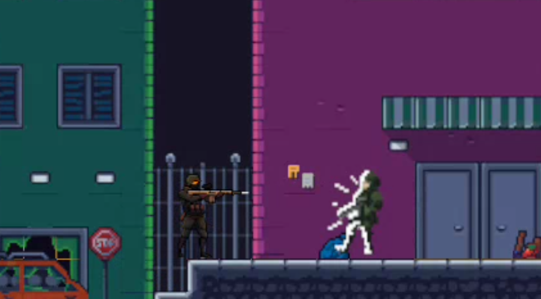
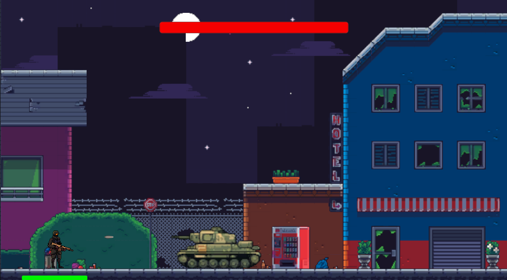

# 🕹️ A Favor — Shooter 2D.


**A Favor** é um jogo eletrônico 2D desenvolvido como projeto final da disciplina  
**XDES17 – Introdução à Codificação de Jogos Digitais** da Universidade Federal de Itajubá (UNIFEI).

---

# 🎮 Screenshots

| Gameplay | Chefe |  
|---------|---------|
|  |  |

---

# 📘 Descrição do Jogo

**A Favor** é um jogo de ação 2D inspirado em clássicos como **Metal Slug** e **Contra**.  
Ambientado em um cenário marcado por crise política e social, o jogador assume o papel de um combatente da resistência e enfrenta inimigos enquanto avança pelas fases até derrotar o chefe principal.

O jogo foi desenvolvido utilizando **Unity Engine** e **C#**, com uma build estável disponível para **Windows**.

---

# 🧩 Principais Funcionalidades

- Movimento e salto responsivos  
- Sistema completo de tiro  
- Inimigos programados com **máquina de estados** (patrulha, perseguição, ataque)  
- Chefe com:
  - Modo **Rage**
  - Rajada especial de tiros
  - Invulnerabilidade temporária  
- Level design urbano destruído  
- HUD com vida, munição e arma ativa  
- Build jogável para Windows

---

# 📂 Estrutura do Repositório

```
A-Favor/
 ├── Assets/
 ├── ProjectSettings/
 ├── Packages/
 ├── README.md
 └── ...
```

---

# 🔧 Como Rodar o Projeto

Para rodar o projeto no Unity:

1. Clone o repositório:  
   ```bash
   git clone git@github.com:FernasG/AFavor.git
   ```
2. Abra o **Unity Hub**
3. Clique em **Add** e selecione a pasta do projeto
4. Abra o projeto normalmente
5. Pressione **Play**

Não é necessário configurar nada adicional.

---

# 🖥️ Build Executável

A build para **Windows 10/11** está disponível no Itch.io (https://ethanbrooks21.itch.io/afavor) 


